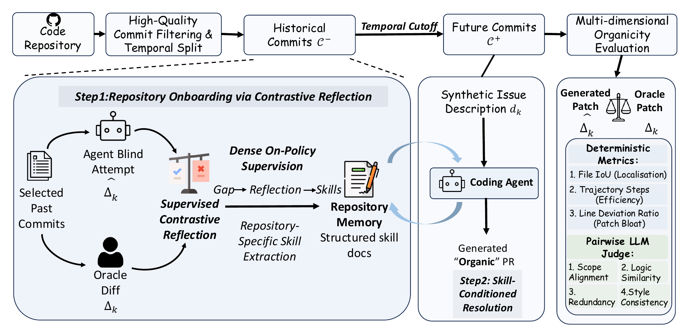

<div align="center">

# Learning to Commit

### Next-Commit Prediction via Online Supervised Contrastive Reflection

Mo Li · Qitai Tan · Kai Chen · Ting Cao · Yunxin Liu

**Tsinghua University**

[**Paper**](https://learningtocommit.github.io/assets/paper.pdf) · [**arXiv**](https://arxiv.org/abs/2603.26664) · [**Project page**](https://learningtocommit.github.io/) · [**Quickstart**](#quickstart) · [**Citation**](#citation)

</div>

## News

- **2026-09-27** — Public code and benchmark data released. This implementation uses the Claude Agent SDK and includes a small example for running the learning and evaluation workflow.

## What is Learning to Commit?

A coding agent can produce a patch that passes tests but still feels out of place in a project: it may
reimplement an existing helper, miss a companion test file, or ignore an architectural convention.
We call the fit between a patch and its repository **organicity**. A repository snapshot shows what the
code looks like today; its commit history shows how maintainers change it.

**Learning to Commit teaches coding agents those patterns through next-commit prediction.** The agent
attempts historical tasks before seeing the accepted human patches, learns from the differences, and
records reusable lessons in a skill document. It then uses that experience to solve future tasks in the
same repository. Learning updates the skill document rather than the model weights.

The paper contributes a learning paradigm based on repository history, a benchmark for evaluating
organicity, and a method for turning the agent's own mistakes into reusable repository knowledge.

## How it works

<p align="center">
  
</p>

1. **Attempt a historical task.** Give the agent the repository snapshot and an issue-style description,
   without revealing the accepted patch.
2. **Compare with the maintainer's solution.** Reveal the human patch and reflect on differences in file
   selection, implementation logic, reuse of existing utilities, and code conventions.
3. **Update repository skills.** Add, revise, or remove lessons in `SKILL.md` and its supporting files.
4. **Solve future tasks.** Supply the accumulated skills alongside a new task and its repository snapshot.

Learning and evaluation are separated in time within each repository: learning commits precede the
held-out test commits. Evaluation considers file localisation, solution patterns, unnecessary changes,
and adherence to project conventions.

## Results reported in the paper

On the **Learning to Commit benchmark**, skills improve file overlap with the expert patch by
**5–7 percentage points** across three models. For Claude Opus 4.6, file overlap rises from **62% to 67%**
and relative patch-size deviation falls from **0.58 to 0.43**.

On a **50-task SWE-bench Pro subset**, the paper reports the following test pass rates:

| Agent model | Without skills | With skills | Improvement |
|:---|---:|---:|---:|
| Kimi K2.5 | 31.0 ± 2.6% | **34.0 ± 2.8%** | +3.0 percentage points |
| Claude Sonnet 4.6 | 34.0 ± 2.3% | **40.0 ± 3.3%** | +6.0 percentage points |
| Claude Opus 4.6 | 48.0 ± 2.8% | **56.0 ± 1.6%** | +8.0 percentage points |

Pass rates are mean ± one standard deviation over four independent runs on the sampled subset,
not the full SWE-bench Pro leaderboard. These are results from the paper's experimental implementation;
the public SDK implementation below is a runnable adaptation, not an exact reproduction of those numbers.

## What is included?

| Component | What you can use |
|:---|:---|
| [Learning and resolution](workflow/) | Sequential historical-task learning, skill-conditioned solving, and a no-skill baseline, built on the [Claude Agent SDK](https://github.com/anthropics/claude-agent-sdk-python). |
| [Learning to Commit benchmark](data/learning_to_commit_benchmark.jsonl) | Five repositories, each with ten learning commits and ten held-out test commits: 50 learning + 50 test commits. |
| [SWE-bench Pro subset](data/swebench_pro_tasks.jsonl) | Fifty tasks, each with three historical learning commits from the same repository. |
| [Evaluation](evaluation/) | File overlap, trajectory steps, patch-size deviation, and a pairwise model judge. |
| [Toy example](examples/toy/) | A small unit-conversion repository with two learning commits and one held-out task. |
| [Data construction](data_construction/) | A five-stage pipeline for building a benchmark from another repository's history. |

The released data includes patches; repository snapshots are prepared separately. This release does not
include the SWE-bench Pro test runner used to measure the paper's test pass rates.

## Quickstart

### Install

Requirements: Python 3.11 or later, [uv](https://docs.astral.sh/uv/), `git`, `tar`, and an Anthropic API key.
Linux and macOS are supported.

```bash
git clone https://github.com/LearningToCommit/LearningToCommit.git
cd LearningToCommit
uv sync
source .venv/bin/activate
cp .env.example .env
```

Set `ANTHROPIC_API_KEY` in `.env`. The default model is `claude-sonnet-4-6`; the SDK wheel includes the
Claude Code CLI. See the [configuration reference](docs/usage.md#configuration) for model and gateway options.

The agent executes commands with your user permissions. Its temporary working directories are not a
security sandbox; run unfamiliar repository tasks in a container or virtual machine.

### Run a small example

The toy agent learns the project's conventions from weight and volume converters, then adds a speed
converter with and without the learned skills. Run these commands from the repository root:

```bash
# Build the small local benchmark.
python examples/toy/build_toy_benchmark.py

# Learn from two historical tasks, then solve with and without skills.
python workflow/run_sequential.py \
    --input-file examples/toy/build/benchmark_tasks.jsonl \
    --signature toy --run-baseline

# Measure file overlap, patch size, and trajectory steps.
python evaluation/programmatic_metrics.py \
    --exp-dir output/toy/claude-sonnet-4-6 \
    --tasks-file examples/toy/build/benchmark_tasks.jsonl

# Compare the patches with a model judge (additional API calls).
python evaluation/pairwise_judge.py \
    --exp-dir output/toy/claude-sonnet-4-6 \
    --tasks-file examples/toy/build/benchmark_tasks.jsonl
```

Inspect the learned skills in
`output/toy/claude-sonnet-4-6/01_onboarding/curriculum_*/final_skills/`, generated patches in
`02_resolution/`, and evaluation results in `03_evaluation/` under the same experiment directory.
Runtime and API cost depend on the selected model; the workflow reports SDK usage at completion.
If you change the model, use its name in the evaluation paths too.

### Continue with real repositories

The [usage guide](docs/usage.md) covers:

- [Preparing and running the released benchmarks](docs/usage.md#running-on-the-released-benchmarks)
- [Evaluation and metric definitions](docs/usage.md#evaluation)
- [Outputs and saved trajectories](docs/usage.md#output-layout)
- [Building a benchmark from your own repository](docs/usage.md#building-a-benchmark-from-your-own-repository)
- [Execution flow](docs/usage.md#execution-flow) and [repository layout](docs/usage.md#repository-layout)

## Implementation scope

The paper's experiments used an internal agent framework. This public release implements the
attempt–reflect–update–solve method using the Claude Agent SDK, without depending on that internal
infrastructure. The agent loop, available tools, context management, and default models differ from the
experimental implementation, so the reported paper scores should not be expected from these commands.
The release supports sequential skill learning; the parallel learning variant is not included.

## Citation

If you use this work, please cite the paper. The title and authors below follow the current manuscript;
the arXiv identifier and URL remain the same across revisions.

```bibtex
@misc{li2026learningcommitgeneratingorganic,
  title = {Learning to Commit: Next-Commit Prediction via Online Supervised Contrastive Reflection},
  author = {Mo Li and Qitai Tan and Kai Chen and Ting Cao and Yunxin Liu},
  year = {2026},
  eprint = {2603.26664},
  archivePrefix = {arXiv},
  primaryClass = {cs.SE},
  url = {https://arxiv.org/abs/2603.26664},
}
```

GitHub's **Cite this repository** menu uses the same paper metadata from [CITATION.cff](CITATION.cff).

## License

The code is released under the [PolyForm Noncommercial License 1.0.0](LICENSE). It is free to use for research, education, and other noncommercial purposes. For commercial use, please contact Mo Li at [limo.research@gmail.com](mailto:limo.research@gmail.com). Third-party code and benchmark materials remain subject to their original licenses.
